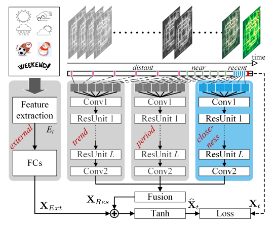

# ST-ResNet in Tensorflow

A TensorFlow implementation of Deep Spatio-Temporal Residual Networks (ST-ResNet) from the paper ["Deep Spatio-Temporal Residual Networks for Citywide Crowd Flows Prediction"](https://arxiv.org/abs/1610.00081). ST-ResNet is an end-to-end deep learning model which uses the unique properties of temporal closeness, period and trend of spatio-temporal data, to forecast the in-flow and out-flow of crowds in a city region. The current code is an implementation of the ST-ResNet architecture, which is adapted from the work by Sneha [Singhania](https://github.com/snehasinghania/STResNet). This repository updates the previous code which was written in TensorFlow 1.8 and Python 2.7. The current architecture have not incorporated the external variable part after the fusion, which will be updated later.

## Model architecture

 

## Prerequisites

* Python 3
* Tensorflow 2

## Usage

To create the TensorFlow computation graph of the ST-ResNet architecture run:

    $ python main.py

## Code Organization

File structure:

* `main.py`: This file contains the main program. The computation graph for ST-ResNet is built, launched in a session and trained here.
* `params.py`: This file contains class Params for hyperparameter declarations.
* `modules.py`: This file contain helper functions and custom neural layers written in a modular style. 
* `st_resnet.py`: This file defines the Tensorflow computation graph for the ST-ResNet (Deep Spatio-temporal Residual Networks) architecture written in an OOP and modular manner. The outline of the architecture from inputs to outputs in defined here using calls to functions defined in modules.py to handle the inner complexity. Modularity ensures that the working of a component can be easily modified in modules.py without changing the skeleton of the ST-ResNet architecture defined in this file.

## Reference

Zhang, Junbo, Yu Zheng, and Dekang Qi. "Deep Spatio-Temporal Residual Networks for Citywide Crowd Flows Prediction." AAAI. 2017. [https://arxiv.org/pdf/1610.00081.pdf](https://arxiv.org/pdf/1610.00081.pdf)
